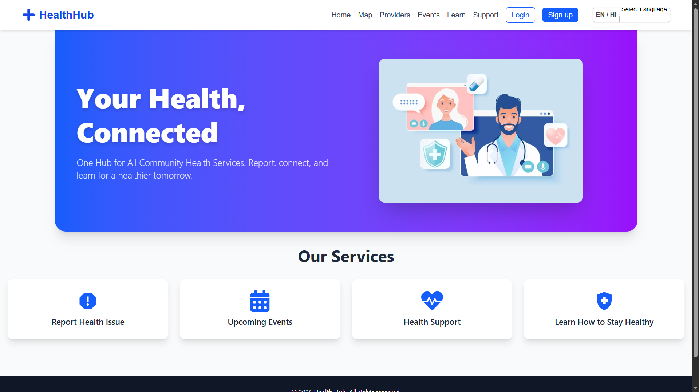
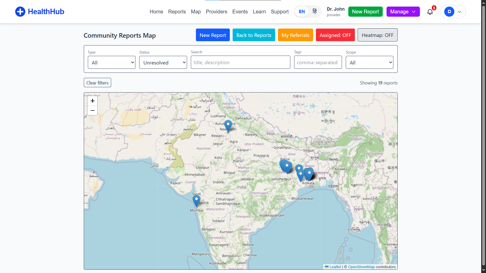
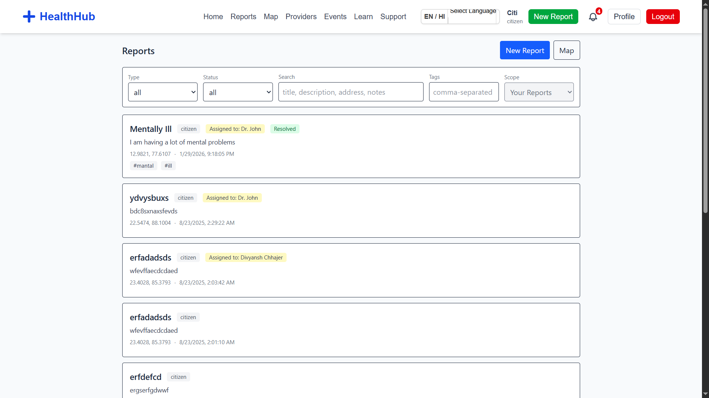
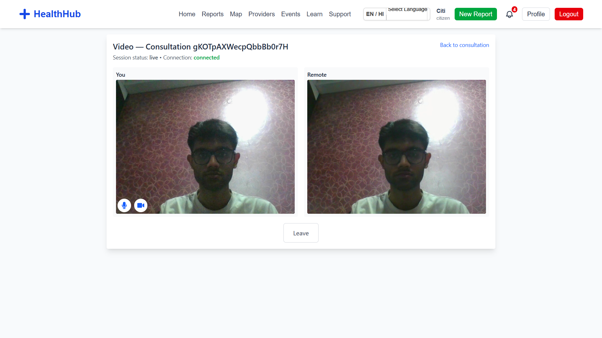
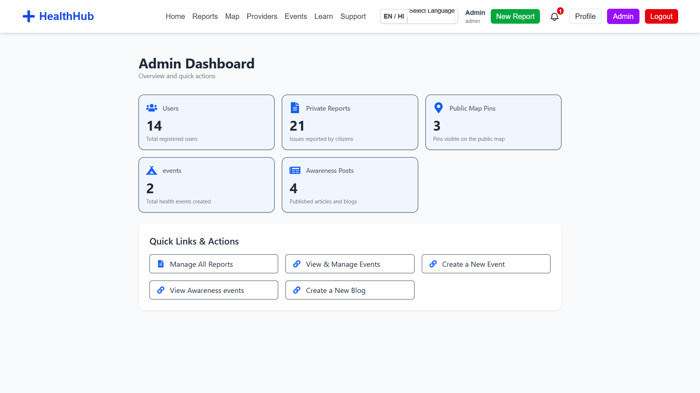
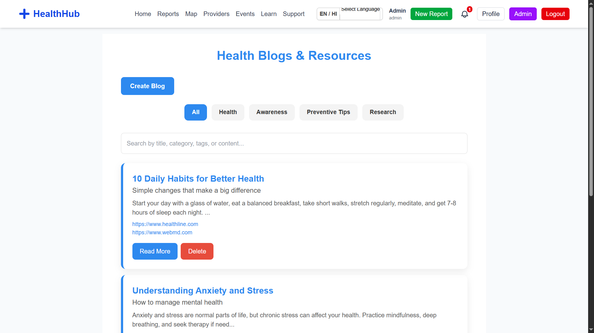

# HealthHub 🏥

**🏆 WINNER: HackHeritage 3.0 (Problem Statement HH308)** *Collaborative Ecosystem for Inclusive Health and Well-Being*

<br />


<br />

**HealthHub** is a collaborative digital ecosystem designed to bridge the gap between marginalized communities, healthcare providers, and NGOs. By leveraging real-time data, role-based access, and telemedicine, HealthHub enables inclusive health monitoring and rapid response to disease outbreaks.

---

## 📸 Application Preview

| Home Page | Interactive Health Map |
|:---:|:---:|
|  |  |

| Reports & Issues | Telemedicine Video Call |
|:---:|:---:|
|  |  |

| Admin Dashboard | Awareness Blogs |
|:---:|:---:|
|  |  |

---

## ✨ Key Features

* **🌍 Real-time Disease Mapping**: Interactive heatmaps and marker clusters (powered by **Leaflet**) allow users to visualize illness outbreaks and health reports geographically.
* **🎥 Integrated Telemedicine**: Seamless, secure, browser-based video consultations using **WebRTC** and Firestore signaling, enabling remote diagnosis for patients in remote areas.
* **🤝 Collaborative Resource Hub**: A verified directory connecting citizens with Doctors, NGOs, and emergency services.
* **📢 Community Reporting**: Citizens can report health hazards (e.g., waste, stagnant water) or illness outbreaks, which are instantly visible to authorities.
* **📊 Admin Command Center**: A comprehensive dashboard for authorities to track campaigns, manage referrals, view analytics (via **Recharts**), and verify providers.
* **🔐 Role-Based Access Control**: Tailored interfaces and permissions for four distinct user types: **Citizens, Providers (Doctors), NGOs, and Admins**.

---

## 🛠️ Tech Stack

### Frontend
* **Framework**: [React](https://react.dev/) (Vite)
* **Styling**: [Tailwind CSS](https://tailwindcss.com/)
* **Routing**: React Router DOM
* **Forms**: React Hook Form + Yup Validation

### Backend & Services
* **Database**: Firebase Firestore (NoSQL, Real-time updates)
* **Authentication**: Firebase Auth
* **Hosting**: Firebase Hosting

### Maps & Real-time
* **Mapping Engine**: [Leaflet](https://leafletjs.com/) & React-Leaflet
* **Heatmaps**: React-Leaflet-Heatmap-Layer
* **Video Communication**: Native WebRTC with Firestore Signaling / PeerJS

### Data Visualization
* **Charts**: [Recharts](https://recharts.org/)

---

## 🚀 Getting Started

Follow these steps to set up the project locally on your machine.

### Prerequisites
* Node.js (v16 or higher)
* npm

### Installation

1.  **Clone the repository**
    ```bash
    git clone [https://github.com/Divyansh2905/HealthHub.git](https://github.com/Divyansh2905/HealthHub.git)
    cd HealthHub
    ```

2.  **Install Dependencies**
    > ⚠️ **Note:** We use `--legacy-peer-deps` to ensure compatibility between React 18 and specific mapping libraries.
    ```bash
    npm install --legacy-peer-deps
    ```

3.  **Environment Setup**
    Create a `.env` file in the root directory and add your Firebase configuration keys:
    ```env
    VITE_API_KEY=your_api_key
    VITE_AUTH_DOMAIN=your_project_id.firebaseapp.com
    VITE_PROJECT_ID=your_project_id
    VITE_STORAGE_BUCKET=your_project_id.firebasestorage.app
    VITE_MESSAGING_SENDER_ID=your_sender_id
    VITE_APP_ID=your_app_id
    ```

4.  **Run the App**
    ```bash
    npm run dev
    ```
    Open [http://localhost:5173](http://localhost:5173) to view it in the browser.

---

## 👥 Team Squad404

Built with ❤️ for **HackHeritage 3.0** at the Heritage Institute of Technology, Kolkata.

* **Divyansh Chhajer** - *Team Lead*
* **Chinmaya Meher**
* **Arkhaprava Mishra**
* **Shibangi Ghosh**

---

<p align="center">
  <i>This project was developed as a solution for Problem Statement HH308.</i>
</p>
